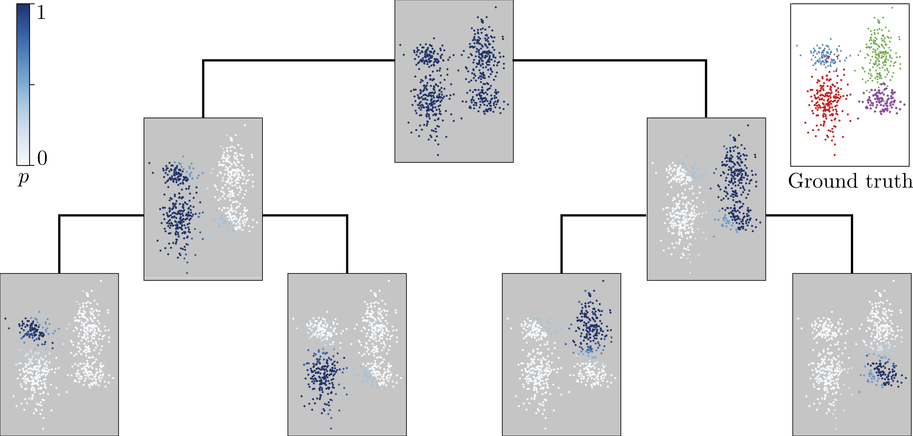

# Code to the publication: Inferring Ancestry with the Hierarchical Soft Clustering Approach tangleGen

[](https://opensource.org/licenses/MIT)


[//]: # (<p align="center">)

[//]: # (  )

[//]: # (</p>)

This code contains the necessary adaptations to the tangles framework to use it in 
population genetics for inferring ancestries. The Tangles algorithm framework is 
available as a Python package and the tangleGen method from the publication "Inferring
Ancestry with the Hierarchical Soft Clustering Approach tangleGen" (doi: https://doi.org/10.1101/2024.03.27.586940 ) is embedded in this 
framework.

The use of tangles is very interesting in population genetics not only because it is a 
hierarchical clustering method, but also because it can be easily adapted to different 
research areas and questions. The following components were newly designed for 
inferring ancestries: The cuts are based on the SNPs and divide the individuals into 
two groups, 
those which are homozygous for the ancestral allele and the others. The cost function is
based on mean FST values and also includes k-nearest neighbors and the soft clustering
indicates the cluster membership of the individuals by taking into account the
reliability of the cuts.

A demonstration on how to use tangleGen on the 1000 Genomes data set is added in
```
demo.ipynb
```
The tanges algorithmic framework is available at `https://github.
com/tml-tuebingen/tangles`.


## Setup

Download the repository. 

Navigate to the tangles directory and install the package using

```
pip install .
```

We recommend to set up a conda environment and install all needed packages as 
specified in `conda_environment.yml` via

```
conda env create -f conda_environment.yml
```

## Overview of the repository

The repository is organized as follows:
+ the directory `src` contains the tangles algorithmic framework together with the 
  file `cost_functions.py`. This file contains all cost functions and if intended to 
  adapt the cost functions, simpy add new cost functions in this file. 
+ the directory `data` contains the data management. Pre-computed cost functions and 
  k-nearest neighbour matrices are saved in `saved_costs` and `saved_kNN` while 
  `with_demography` consists of all simulated data files. vcf files are to be stored 
  in the subdirectory `vcf`.
+ the directory `plots` contains all generated plots. 

Besides this, the following scripts are central:
+ `demo.ipynb`: tangleGen demo for the 1000 Genomes project.
+ `read_vcf`: read and pre-process vcf files.
+ `simulate_with_demography`: simulates phylogenetic data with an underlying 
  demography. With this script, all simulations of the publication are conducted.
+ `compute_kNN.py`: pre-computes k-nearest neighbours for the cost computation.
+ `reliability_factor.py`: computes the reliabilty factors of the cuts for the soft 
  clustering.
+ `plot_soft_clustering.py`: plots the soft clustering.
+ `tangles_env.yml`: conda environment to run tangles and tangleGen.

## How to run tangleGen
To infer ancestries with tangleGen, a script needs to contain the following modules:

    1. Set parameters
    2. Load data
    3. Preprocess data
    4. Constructing cuts
    5. Computing costs
    6. Constructing the tangles tree: For each cut compute the tangles by expanding on 
        the previous ones if it is consistent. If its not possible stop
    7. Read out typical genome 
    8. Compute set of characterizing cuts
    9. Postprocess in soft clustering and plot

A detailed execution of these steps for the 1000 Genomes project is shown in the 
demonstration `demo.ipynb`.
